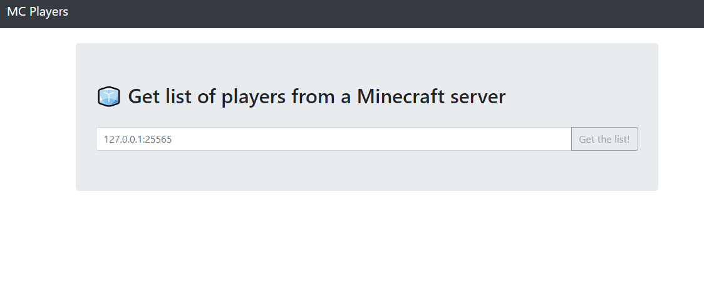
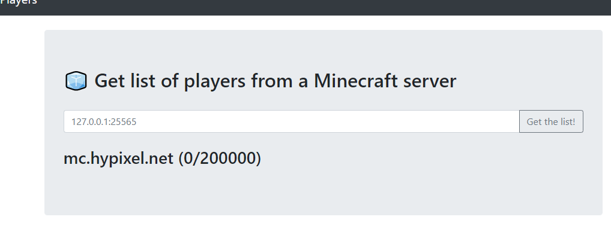
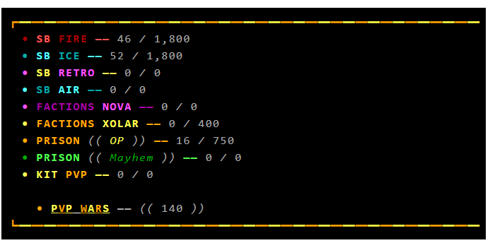
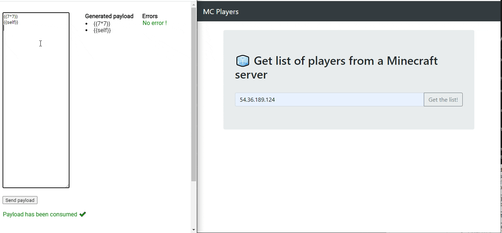

# MC Players | ⭐⭐⭐
Cela fait plusieurs mois que le service de [Dinnerbone](https://dinnerbone.com/minecraft/tools/status/) permettant de récupérer le statut d'un serveur Minecraft n'est plus actif. Nous avons donc décidé de proposer une alternative réutilisant sa librairie [mcstatus](https://github.com/py-mine/mcstatus).

## Introduction
Nous avons accès au code source de l'application qui est composé de 2 dockers.

Nous savons donc directement que nous sommes sur un serveur web en Python, utilisant Flask ainsi que le moteur de template Jinja2
<br /><br />

## Lancement de l'application



Nous avons affaire à un simple "status checker", pour les serveurs Minecraft

J'essaie dans un premier temps de mettre un serveur existant, avec des joueurs connectés afin de voir le résultat:



Au bout de quelques secondes, nous avons un résultat. La plupart des serveurs Minecraft ne retournent pas la liste de leur joueurs connectés, mais plutôt un message custom de ce style:



Nous verrons juste après que notre application ne gère pas les lignes composées de + 20 caractères, il est donc normal que nous ne voyons pas de joueurs connectés via notre application
# Analyse du code source

```py
#!/usr/bin/env python3
# coding: utf-8

import re
import requests
from mcstatus import JavaServer
from flask import Flask, render_template, render_template_string, request


FLAG = requests.get('http://mc-players-flag:1337/').text

app = Flask(__name__, template_folder='./')
app.config['DEBUG'] = False

@app.route('/', methods=['GET', 'POST'])
def index():
    if request.method != 'POST' or 'server' not in request.form.keys():
        return render_template('index.html')

    server = request.form['server'].split(':')
    if len(server) == 2:
        hostname = server[0]
        port = int(server[1])
    else:
        hostname = server[0]
        port = 25565

    try:
        ms = JavaServer(hostname, port)
        status = ms.status()
    except:
        error = '''
            <br>
            <div class='alert alert-danger' role='alert'>
                An error occurred while communicating with the MC server.
            </div>
        '''
        return render_template('index.html', error=error)

    players = []
    if status.players.sample is not None:
        for player in status.players.sample:
            if re.match(r'\w*', player.name) and len(player.name) <= 20:
                players.append(player.name)

    html_player_list = f'''
        <br>
        <h3>{hostname} ({len(players)}/{status.players.max})</h3>
        <ul>
    '''
    for player in players:
        html_player_list += '<li>' + player + '</li>'
    html_player_list += '</ul>'

    results = render_template_string(html_player_list)
    return render_template('index.html', results=results)


@app.route('/flag', methods=['GET'])
def flag():
    if request.remote_addr != '13.37.13.37':
        return 'Unauthorized IP address: ' + request.remote_addr
    return FLAG


if __name__ == '__main__':
    app.run(host='0.0.0.0', port=2156, threaded=False)

```

Pour ce challenge, nous pouvons uniquement se concentrer sur le code du serveur.

- Le flag est récupéré sur un autre container docker "mc-players-flag", qui se détruit juste après avoir envoyé le flag.

- L'hostname & le port sont passés à la lib mcstatus

- Si il n'y a pas eu d'erreur, nous construisons la liste des joueurs, avec le résultat status.players.sample, renvoyé par mcstatus

- Si un pseudo est supérieur à 20 char ou qu'il ne contient aucun caractère alphanumérique, il n'est pas ajouté à la liste. En effet, la regex ```r'\w*'``` est validée si il y a au moins 1 caractère alphanumérique.

- Le template qui va être envoyé à Jinja2 est ensuite construit, en utilisant les informations récupérées précédement

- Le template est render & envoyé au client

Le bloc qui construit le template est très probablement vulnérable à une injection SSTI
```py
    html_player_list = f'''
        <br>
        <h3>{hostname} ({len(players)}/{status.players.max})</h3>
        <ul>
    '''
    for player in players:
        html_player_list += '<li>' + player + '</li>'
    html_player_list += '</ul>'

    results = render_template_string(html_player_list)
```

Liste des variables contenu dans le template:
- hostname
- status.players.max
- la liste des joueurs

# SSTI ?

Afin de confirmer que nous sommes bien sur un exploit de type SSTI, je cherche les paramètres qui peuvent être manipulés dans le template

## hostame
- Ce paramètre doit contenir une adresse valide, et ne peut donc pas être manipulé

## status.players.max

- Après avoir analyser la lib mcstatus, ce paramètre doit être un int. Nous ne pourrons donc rien faire avec

## La liste des joueurs

- Il ne nous reste donc plus que cette liste, qui peut être vulnerable si nous contrôllons la liste des joueurs reçus par mcstatus

Comme vue précédement, si la taille du pseudo est inférieure ou égale à 20 caractères, le pseudo est directement ajouté dans le template

Nous pouvons donc faire une SSTI: en envoyant un pseudo du type: {{7*7}}, nous aurons 49 dans la liste des joueurs !

# Simulation d'un serveur Minecraft

Afin d'exploiter cette vulnérabilité, nous avons besoin de controler les résultats que la lib mcstatus va recevoir

L'objectif va donc être de créer un serveur minecraft, dont nous controllons les réponses

Pour cela, j'ai utilisé la librairie NodeJS "minecraft-protocole", qui va me permettre de créer un serveur minecraft très simple

Il y des implémentations du protocole minecraft dans beaucoup d'autres langages, si le NodeJS vous répugne..

Mon objectif est donc de créer un serveur minecraft, créer fausse liste de joueurs contenant mes payload SSTI, et de répondre à mcstatus avec cette liste

Après avoir bien galéré à faire une application qui me permet de générer des payloads & de créer un serveur minecraft, j'ai enfin un résultat plutôt propre



Je peux maintenant générer des payloads et les envoyer à l'application plutôt simplement

# Exploitation

Nous pouvons enfin commencer notre exploitation

Nous pouvons voir un endpoint /flag dans notre application, qui retourne le flag si l'ip correspond à 13.37.13.37. Ce n'est évidement pas l'ip du serveur, donc l'idée de faire leak la page /flag au serveur n'est probablement pas la solution

Le seul autre endroit où le flag est accessible est via la constante FLAG définis au tout début du code

En remontant tous les prototypes d'objets/fonctions, nous pouvons théoriquement accèder à toutes les méthodes, objects, constantes créés une application python

Nous devons maintenant trouver un moyen de remonter jusqu'au FLAG

Voici un exemple de payload, permettant d'executer: ```{{request['application'].__init__}}```

```





{{a[b][c]}}
```

Je ne passerais pas en détails tous les tests que j'ai pu faire, et à quel point c'est long de créer un payload pour une SSTI avec uniquement une liste de chaines de 20 caractères.. :)


Après de longues heures de recherches et d'essais, je tombe sur un writeup plutôt interessant: https://ctftime.org/writeup/10851

Au lieu de chercher à la main comment remonter dans le context global afin de trouver la constante FLAG, j'ai utlisé le script de parcours automatique récupéré dans le writeup.


```python

@app.route('/search')
def search_flag():
    for path, obj in search(request, 10):
        if str(obj) == FLAG:
            return path
```

Cette route va me permettre de parcourir tous les paths possibles, jusqu'à tomber sur un objet dont la valeur est égale a notre constante FLAG

```sh
curl  http://127.0.0.1/search
```

Au bout de quelques minutes, la page me retourne une réponse !

```sh
obj.__class__._load_form_data.__globals__['json'].JSONEncoder.default.__globals__['current_app'].view_functions['index'].__globals__['FLAG']
```


(obj correspond à request)

je constuis donc mon payload afin de correspondre à ce path, ce qui me permet de récupérer le flag

## Conclusion

La partie la plus longue du challenge était finalement de simuler un serveur minecraft et de générer les payloads

Ayant accès au code source, nous pouvons ensuite 'simplement' retrouver le path vers la constante FLAG via un parcours automatique